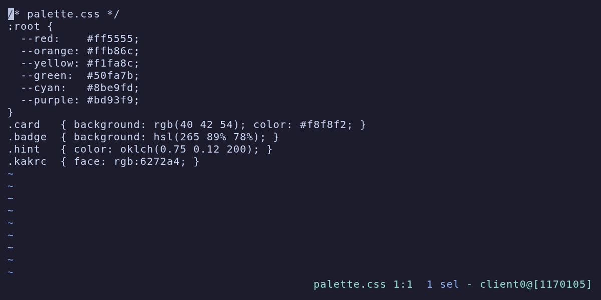

# colorcol-rs

A [Kakoune](https://kakoune.org) plugin that previews color literals inline, in the gutter, or as a
marker after the literal. A Rust rewrite of [SolitudeSF/colorcol](https://github.com/SolitudeSF/colorcol).



## Install

```sh
cargo install --path .
```

With [kak-bundle](https://github.com/jdugan6240/kak-bundle):

```kak
bundle colorcol-rs "https://github.com/jtrv/colorcol-rs"
bundle-install-hook colorcol-rs %{ cargo install --path . ; cargo clean }
```
Then in your `kakrc`:

```kak
evaluate-commands %sh{ colorcol }

hook global WinCreate .* %{
  colorcol-enable
  colorcol-refresh-continuous
}
```

`colorcol-enable` turns it on for the window; `colorcol-refresh`, `colorcol-refresh-on-save`, and
`colorcol-refresh-continuous` control when it recolors. `colorcol-mode background|foreground|append|flag`
picks how colors are shown. `colorcol-disable` turns it off.

## Supported formats

| | example |
|---|---|
| hex | `#f00` `#f008` `#ff0000` `#ff000080` |
| Kakoune face syntax | `rgb:ff0000` `rgba:ff000080` |
| CSS functional | `rgb(255 0 0)` `rgba(255,0,0,.5)` `hsl(180 50% 50%)` `hsla(...)` `hwb(180 30% 40%)` |
| CSS perceptual | `oklch(0.7 0.1 200)` `oklab(0.7 0.1 -0.05)` `lch(29.6% 131.2 301.4)` `lab(29.6% 68.3 -112)` |

A `#` literal needs no word boundary on its left, so `word#ff0000` previews — and so does the
fragment of a URL like `example.com/#abc123`. That is the same behavior as the original, and the
tradeoff is deliberate: requiring a boundary would suppress only 0.05% of `#hex` occurrences in a
real corpus, none of them in source files.

Not supported, on purpose: `0xRRGGBB` (in a scan of `/usr/include`, 2,879 six-hex and 73,644 eight-hex
`0x` literals — over 90% are bitmasks, addresses, and magic numbers, and `0xAARRGGBB` vs `0xRRGGBBAA`
is genuinely ambiguous), named CSS colors (`tan` is a trig function; `red` appears 1,148 times in
`/usr/share/doc` prose), and `color(display-p3 ...)` / `color(xyz ...)` (wide-gamut colors cannot be
shown honestly in 8-bit sRGB, and every `color(` hit in a large corpus was an unrelated function call,
not a color).

## Options

| option | default | |
|---|---|---|
| `colorcol_color_full` | `true` | color the whole literal, not just its first byte |
| `colorcol_max_flags` | `3` | markers per line in `flag` mode |
| `colorcol_flag_str` | `█` | gutter marker |
| `colorcol_append_str` | `■` | marker drawn after the literal |
| `colorcol_alpha_bg` | `''` | background to composite translucent colors over |

### A note on alpha

Kakoune parses the alpha byte of an `rgba:` face and then **discards it** when writing the terminal
escape sequence — `rgba:ff000080` and `rgb:ff0000` emit byte-identical output. So by default
`#ff000080` previews as fully opaque red. This is lossless (the alpha reaches Kakoune, and the JSON UI
forwards it, so a future blending client would get it) but it is not *visible*.

To actually see alpha, tell colorcol what to blend against:

```kak
set global colorcol_alpha_bg 1a1a2e   # your terminal background
```

Now `#ff000080` previews as `#8d0d17` — red at 50% over `#1a1a2e`, the same result a browser paints
for `background-color: rgba(255,0,0,.5)`. Opaque colors are unaffected.

## Differences from the Nim original (0.5.4)

Bugs fixed:

- A color literal at the very end of a buffer **crashed** the binary (`IndexDefect`), so nothing was
  highlighted at all.
- `colorcol_flag_str` / `colorcol_append_str` were interpolated into kakscript unescaped. A marker
  containing an apostrophe or a space produced a `set` arity error that aborted the whole `%sh{}`
  block — one odd character in a config option silently disabled every preview.
- Adjacent literals were dropped: `#f00#0f0#00f` previewed only the first and third.
- `colorcol-enable` installed a window-scoped `BufCreate` hook, which never fires. It is now
  `WinDisplay`, so buffers recolor when you switch to them.
- `colorcol-disable` raised `no such id` if colorcol had never been enabled in that window.

Deliberate behavior changes:

- `background` mode now picks a legible black/white foreground by WCAG luminance instead of leaving it
  at `default`, which can leave swatches illegible.
- `rgb:abc` and `rgb:deadbeef` no longer preview. Kakoune's `rgb:` face requires exactly six hex digits;
  the original rendered colors Kakoune's own parser would reject.
- `rgba:RRGGBBAA` now previews too (exactly eight hex digits, matching Kakoune's own `str_to_color`).
  The original never recognized `rgba:` as scannable input at all, only `rgb:`.
- Alpha is preserved rather than silently dropped (see above).
- `xrgb:ff0000` no longer matches — `rgb:` now needs a word boundary on the left.
- Hex output is lowercased. Kakoune's `rgb:` is case-insensitive, so this renders identically.

## Development

```sh
cargo test                                       # unit + golden tests
COLORCOL_ORIG=/path/to/nim/colorcol cargo test   # + differential test against the original
```

The differential test runs the Nim binary and this one over a shared corpus and asserts byte-identical
output for `foreground` and `append` modes, which makes the original an executable oracle for the
scanner. See `tests/differential.rs` for the corpus and the list of intentional divergences.
